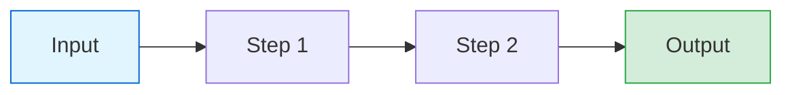
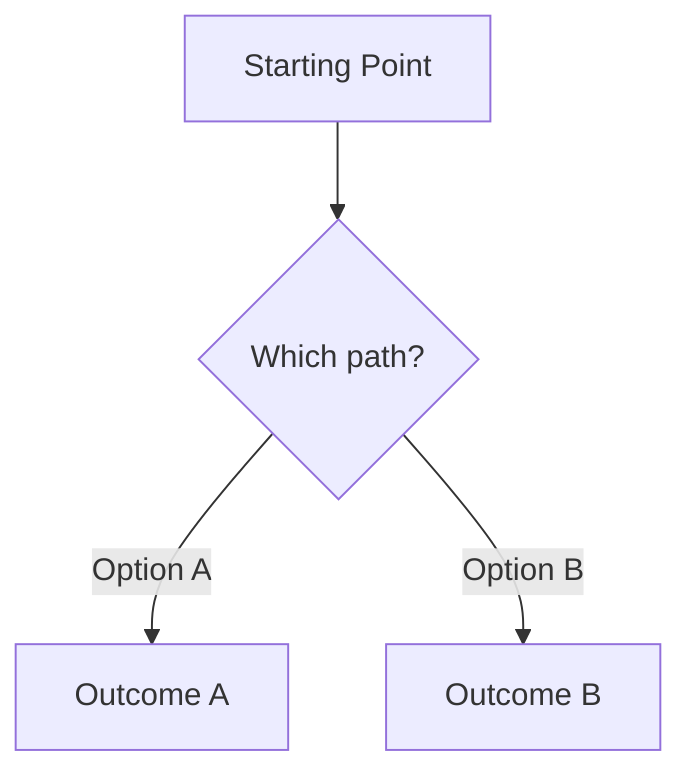
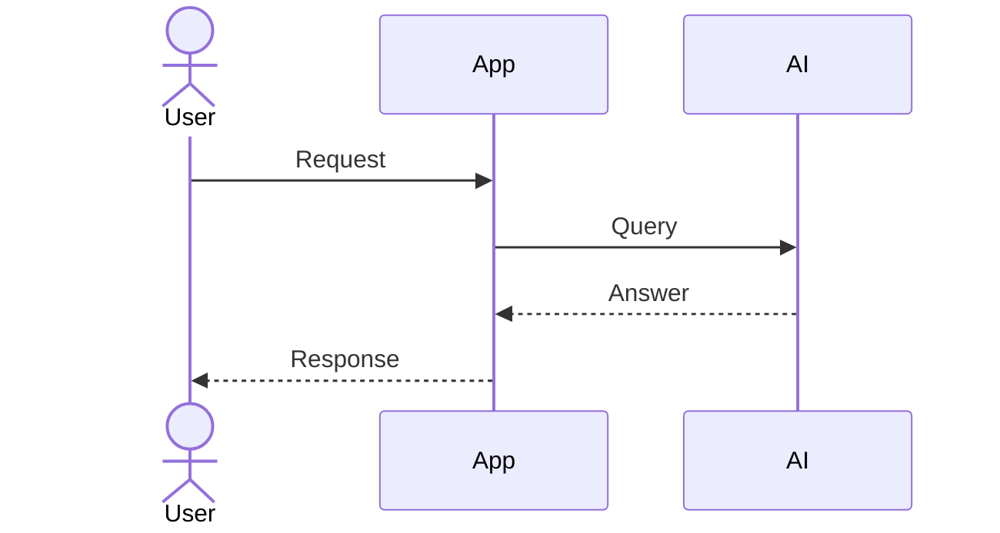
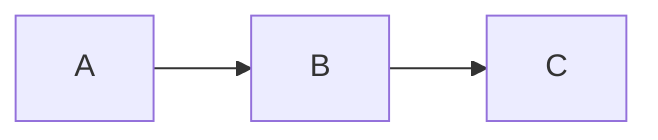

# How to Craft Workflow Diagrams

_The reusable guide. Open this file first, every time you need to explain something visually._

---

## Why diagrams

Prose hides three things a diagram exposes:

1. **Parallelism** - what runs at the same time vs what blocks
2. **Human gates** - where you step in and where automation runs alone
3. **Failure loops** - what retries, what escalates, what gets dropped

A business partner, a student, a client, or Claude all understand "scraper → Claude → publisher" in 2 seconds. A paragraph that says the same thing takes 30 seconds and still leaves ambiguity.

---

## The 5 Legibility Principles

Apply these to every diagram you make.

### 1. One verb per node
- Bad: "Video Ingestion Subsystem"
- Good: "Scrape Videos"

Nouns describe things. Verbs describe flow. Flow diagrams need verbs.

### 2. Left-to-right for processes. Top-to-bottom for hierarchies.
Readers read one direction. Pick it and commit. Mixing both in the same diagram loses 30% of your audience.

- Pipeline of steps → `flowchart LR`
- Org chart, decision tree, layered architecture → `flowchart TB`

### 3. Max 9 nodes per diagram
If you have more than 9 boxes, you have two diagrams, not one. Split into:
- **Overview diagram** (5-7 nodes, one level up)
- **Zoom-in diagram** (5-9 nodes, detail of one overview node)

9 is the cognitive limit for "I understand this at a glance." Past that, people zone out.

### 4. Color means state, not decoration
Commit to one color code and use it everywhere:

| Color | Means |
|---|---|
| Green | Built / done / working |
| Yellow | In progress / partial |
| Red | Blocked / not started / risk |
| Blue | Human step |
| Gray | AI / automated step |

If you use green for "start" and green for "done" in the same diagram, the color loses meaning. Don't.

### 5. Caption every diagram
Every diagram gets a header that answers two questions:

```
AUDIENCE: <who is this for>
QUESTION: <the one question this diagram answers>
```

Examples:
- `AUDIENCE: SDIC recruits. QUESTION: What will I build in 4 weeks?`
- `AUDIENCE: 영범. QUESTION: How does one Short get made, end to end?`

If you can't fill these two lines, the diagram doesn't know its job. Fix that before drawing.

---

## The Napkin-to-Diagram Workflow

Use this live with your business partner. No tools needed for step 1-3.

### Step 1 - Napkin (5 min)
Write the 3-5 nouns involved. Draw arrows. Don't worry about format.

Example with 영범:
```
Trending Scraper → Video Download → Whisper → Claude Haiku → ffmpeg → Review → Publish
```

### Step 2 - The One-Breath Test
Explain the napkin out loud in one breath. If you can't, you have too many nodes. Cut.

### Step 3 - Pick the Audience
Different audience, different diagram. Do not try to make one diagram for everyone.

| Audience | What they care about |
|---|---|
| Partner (영범) | What I do vs what they do |
| Investor | Revenue flow, unit economics |
| Student (SDIC) | What they'll build, in plain language |
| Client | Before → After, not the internals |
| Claude | Full system with state and gates |

### Step 4 - Transfer to Mermaid (2 min)
Open [mermaid.live](https://mermaid.live). Fork one of the templates in this folder. Type the nouns from step 1 as nodes, draw the arrows.

### Step 5 - Red-Team It
Show the diagram to someone who has never seen it. If they ask "what is X?", X is jargon. Replace with plainer words.

---

## Template Library

Three shapes cover ~80% of everything you'll draw.

### Template A - Process / Pipeline (`flowchart LR`)
Most common. Use whenever something flows: data, content, money, users.



Fork for: YouTube pipeline, RAG flow, content calendar, client onboarding.

### Template B - Branching / Decision (`flowchart TB` with diamond)
Use when there's a choice or a split.



Fork for: 4-week vs 6-week curriculum, which channel to post to, pricing tier picker.

### Template C - Step-by-Step Timing (`sequenceDiagram`)
Use when *order* and *who does what* matters more than the boxes.



Fork for: single-video production, API call flow, consulting client call structure.

---

## How to Send Diagrams to Claude

Yes - diagrams make my job significantly easier. I can read Mermaid natively.

### Preferred: paste raw Mermaid code
Open a chat with me and paste:

````

````

I read the source. I can edit it and send it back. No information lost.

### Acceptable: screenshot of napkin
Photograph the paper, upload, and caption:
> This is the pipeline we agreed on. Convert to Mermaid and flag anything ambiguous.

I will render it, list my interpretation, and ask about anything unclear.

### Always include the 3-line header
Before the diagram, paste:

```
AUDIENCE: <who>
QUESTION: <the one question>
STATUS: draft | agreed with partner | final
```

This tells me what feedback you want:
- `draft` → I critique structure, suggest restructure
- `agreed with partner` → I only flag contradictions with context files, don't restructure
- `final` → I only check rendering and spelling

---

## Automated Generation

Use `/diagram` to generate a new diagram automatically. It:
1. Loads this file (style guide + color legend)
2. Takes your prose / topic / file path as input
3. Generates Mermaid following all 5 principles
4. Writes to `references/diagrams/<topic>.md` with the 3-line header
5. Self-validates before saving

For tool selection and rendering targets, see `_WHERE_TO_RENDER.md`.

---

## File Index (this folder)

| File | Use when |
|---|---|
| `_HOW_TO_CRAFT.md` | Open first. This file. |
| `_WHERE_TO_RENDER.md` | Picking a tool to render or manually draw |
| `sdic-curriculum.md` | Teaching SDIC, recruiting members, explaining curriculum |
| `content-business-pipelines.md` | Talking to 영범, planning content automation, showing the 7:3 split |
| `finagent-architecture.md` | Explaining FinAgent to clients, interviewers, or SDIC |
| `youtube-channel-intro-template.md` | Excalidraw cold-open template for First Mover AI videos |

Add new diagrams here. One file per domain, not one diagram per file.
