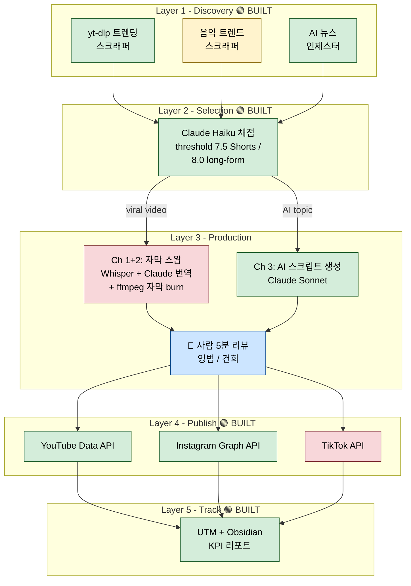
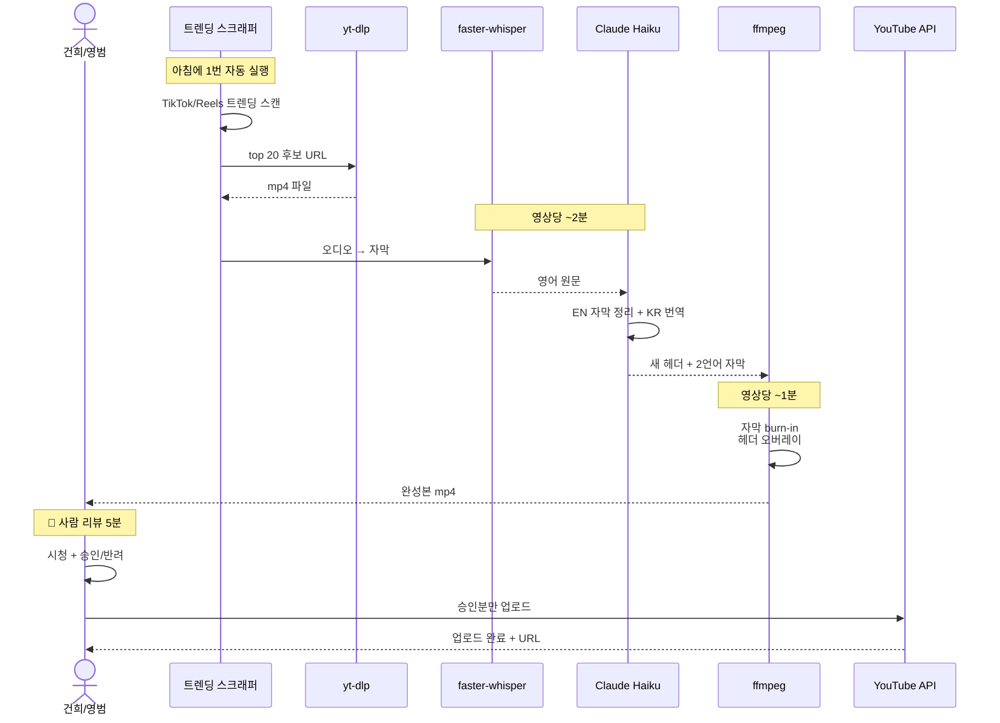
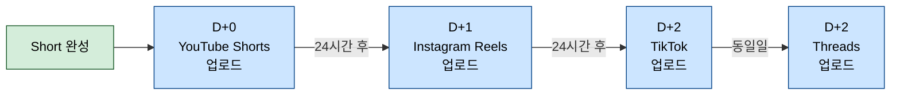

# Content Business - Pipeline Diagrams

_3-channel model. 7:3 split (70% AI study, 30% content). Partner: 영범._

---

## The model (as of 2026-04-21)

| # | Channel | Language | Format | Cadence |
|---|---|---|---|---|
| 1 | English Viral Repurpose | EN + KR subs | 4 Shorts + 1 long-form/day | Subtitle-swap + header rewrite on existing viral videos |
| 2 | English Song | EN + KR subs | Shorts only (TBD cadence) | Viral songs with synced subtitles |
| 3 | AI Channel | EN | 3 Shorts + 1 long-form/day | Original AI education content |

**2026 reality check:** YouTube's July 2025 policy bans pure template mass-production from monetization. Automation handles discovery, editing, publishing. A human adds the creative layer (header rewrites, voice-over, commentary). Semi-automated wins.

---

## 2a. Master Pipeline (all 3 channels share one backbone)

```
AUDIENCE: 영범 + 나
QUESTION: 우리 3개 채널이 어떻게 같은 인프라를 공유하지?
STATUS: draft with partner
```



**Legend:** 🟢 built / 🟡 half-built / 🔴 not yet / 🔵 human step

**Gap analysis:**
- Layer 3 자막 스왑 모듈 (Ch 1+2 핵심) - **아직 없음, 빌드 필요**
- 음악 트렌드 스크래퍼 (Ch 2) - 부분 구현
- TikTok API (Layer 4) - Phase 2

**Use this for:** 영범과 "우리 인프라 어디까지 와 있어?" 대화, 개발 우선순위 정할 때.

---

## 2b. Daily Routine - 7:3 Time Split

```
AUDIENCE: 나 + 영범
QUESTION: 하루에 AI 공부 6시간 지키면서 콘텐츠는 언제 만들어?
STATUS: draft
```



```mermaid
gantt
    title 평일 하루 월-금
    dateFormat HH:mm
    axisFormat %H:%M

    section AI Study 70%
    Deep work block 1    :ai1, 08:00, 3h
    Lunch                :milestone, 11:00, 0m
    Deep work block 2    :ai2, 12:00, 3h

    section Content 30%
    Batch production     :crit, content1, 15:00, 2h
    Review + schedule    :content2, 17:00, 30m

    section Buffer
    Admin + Jeja         :buf, 17:30, 1h
```

**Batch mode rule:** 한 번 앉아서 3-5일치를 미리 만든다. 매일 찍지 말 것 - context switch 비용이 크다.

**Use this for:** 영범한테 "매일 뭐 하는지" 보여주기, 공부 시간 침범당할 때 근거 자료.

---

## 2c. One Short - End-to-End (subtitle-swap variant)

```
AUDIENCE: 영범 (개발 전)
QUESTION: 바이럴 영상 하나로 Short 하나 만드는 데 몇 분 걸려?
STATUS: agreed with partner
```



**1개 Short 총 소요:** 자동 부분 ~5분 + 사람 리뷰 5분 = **~10분/개**.
배치로 4개 찍으면 40분 + 리뷰 20분 = **1시간/일**.

**Use this for:** 영범과 작업 분담 ("누가 리뷰할지"), 하루 목표량 현실성 점검.

---

## 2d. Cross-Post Schedule (한 Short을 여러 플랫폼에)

```
AUDIENCE: 나
QUESTION: YouTube Shorts 올린 거 언제 Instagram/TikTok에 올리지?
STATUS: draft
```



**왜 시차 두나:** 각 플랫폼 알고리즘은 "다른 플랫폼 워터마크" + "동시 업로드"를 불이익으로 감점. 24-48시간 간격 두면 각 플랫폼이 "독점적으로 받은 새 콘텐츠"로 인식해 초기 도달률이 올라감 (2026 연구 기준).

**Use this for:** 업로드 캘린더 자동화 설계, 영범한테 "왜 바로 다 안 올리냐?" 질문에 답.

---

## Build vs Reuse - 액션 아이템

### 이미 있는 거 (`projects/youtube-biz/core/`에서 바로 재사용)
- `layer1_ingestion/viral_ai_videos.py` - 트렌딩 스크래퍼
- `layer2_intelligence/ranker.py` - 품질 채점
- `layer4_publishing/youtube_api.py` + `instagram_graph.py`
- `layer5_observability/` - UTM + KPI 리포터

### 새로 빌드 필요 (Ch 1+2 위해)
- [ ] Whisper 전사 모듈 (faster-whisper 이미 requirements에 있음)
- [ ] 2언어 자막 생성기 (Claude Haiku 번역 + ffmpeg burn)
- [ ] 헤더/썸네일 리라이터 (Claude)
- [ ] 음악 트렌드 스크래퍼 (Ch 2)

### Off-the-shelf 대안 (DIY 막히면)
- **FlowShorts** - $19/mo, 8 영상. 스크립트 → 영상 → 멀티 플랫폼 자동 업로드
- **Repurpose.io** - 크로스 플랫폼 자동 재업로드
- **ShortSync** - 멀티 플랫폼 스케줄링 + 플랫폼별 캡션 자동 조정

---

## Sources (research)

- [Best AI Tools to Automate a Faceless YouTube Channel (2026) - FlowShorts](https://flowshorts.app/blog/best-ai-tools-faceless-youtube-channel)
- [AI Faceless YouTube Channels 2026: Complete Automation Stack - Virvid](https://virvid.ai/blog/ai-faceless-youtube-automation-stack-2026)
- [How to Automate a YouTube Channel (2026) - FlowShorts](https://flowshorts.app/blog/how-to-automate-youtube-channel)
- [Cross-Post Videos to Multiple Platforms (2026) - ShortSync](https://www.shortsync.app/resources/cross-post-videos-multiple-platforms)
- [Short-Form Video Trends 2026 - ShortSync](https://www.shortsync.app/resources/short-form-video-trends-2026)
- [Repurpose.io - Auto cross-post](https://repurpose.io/grow-youtube-shorts/)
