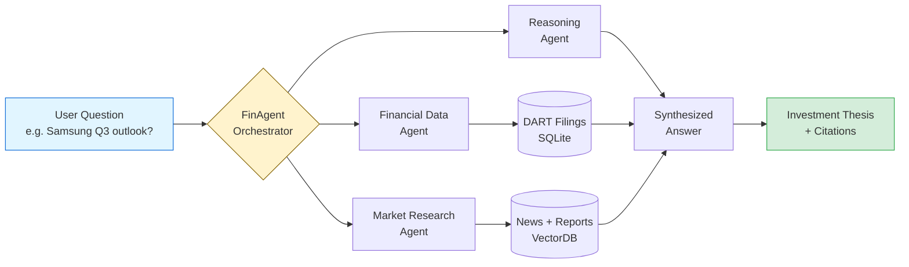
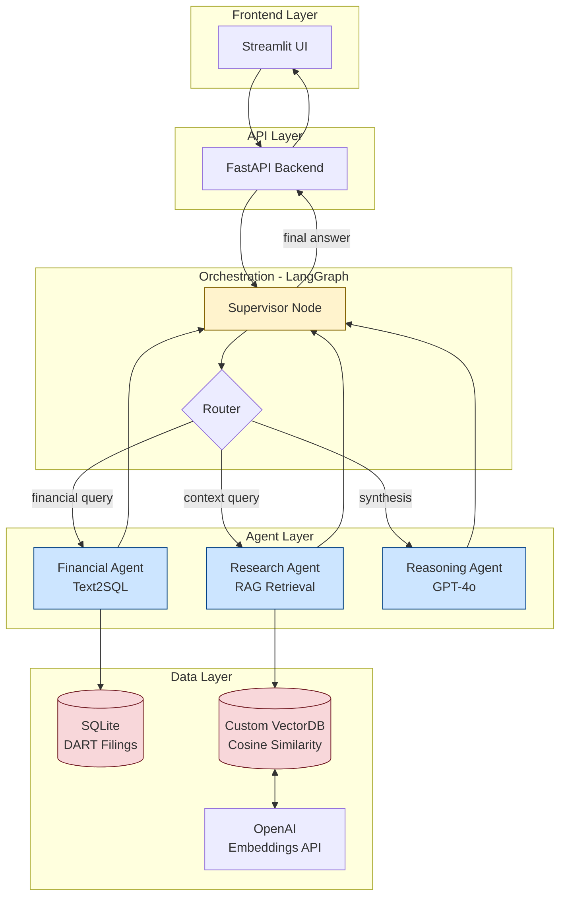
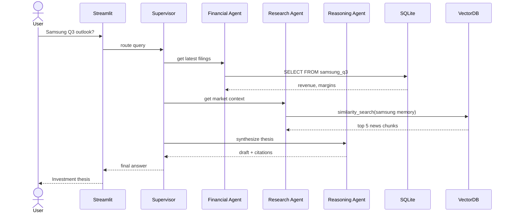

# FinAgent — Architecture Diagram

Multi-agent financial analysis system. Use this diagram in pitch decks, SDIC teaching, and GitHub README.

---

## Business-facing version (for clients, pitches, non-technical audiences)



**Talking points:**
- One question in, structured thesis out
- Three specialized agents beat one generalist LLM
- Every claim cited back to source filings or news

---

## Technical version (for SDIC teaching, GitHub README, engineering audiences)



**Teaching points for SDIC:**
- **Supervisor pattern:** one node decides which agent runs. This is the core LangGraph pattern.
- **Why custom VectorDB?** Built from scratch with numpy cosine similarity to understand what Pinecone/Chroma do under the hood.
- **Text2SQL vs RAG:** structured data (filings) goes to SQL, unstructured (news) goes to vectors. Pick the right retrieval for the data shape.
- **Why LangGraph not LangChain?** State machine model handles multi-step reasoning and retries cleanly; LangChain chains break when agents need to loop back.

---

## Sequence version (for explaining the flow step-by-step)



---

## Where to use each version

| Version | Use for |
|---|---|
| Business flowchart | Client pitches, Soomgo listings, YouTube demo thumbnails, LinkedIn posts |
| Technical flowchart | GitHub README, SDIC curriculum slides, consulting interview whiteboard |
| Sequence diagram | Step-by-step teaching, debugging sessions, technical blog posts |

---

## How to render

- **Notion:** paste inside a `/code` block with language set to `mermaid`
- **GitHub:** paste inside a ` ```mermaid ` fence in any .md file (renders natively)
- **PDF/Deck:** render at [mermaid.live](https://mermaid.live), export as SVG, drop into Figma/Keynote
- **Claude artifacts:** paste as mermaid code block
