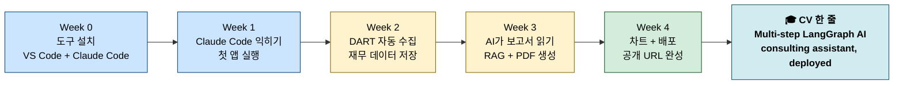
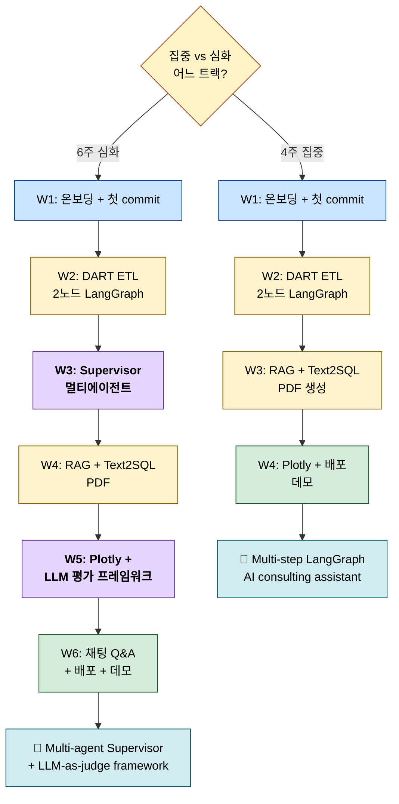
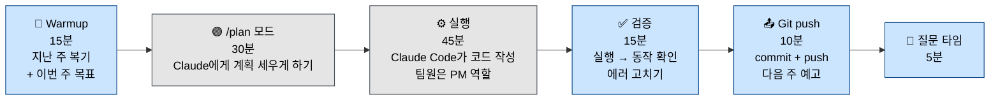

# SDIC AI 컨설팅 어시스턴트 - 커리큘럼 다이어그램

_Companion to the Notion page "SDIC AI 컨설팅 어시스턴트 - 코스 안내". Three diagrams, three audiences._

---

## 1a. Student Journey - for first-time recruits

```
AUDIENCE: SDIC 신입 멤버 (AI를 처음 쓰는 학생)
QUESTION: 이 과정을 끝내면 내가 뭘 만들 수 있어?
STATUS: final
```



**Use this for:** 신입 모집 인스타 스토리, 첫 OT 핸드아웃, 학부모/친구한테 "뭐 배우는 거야?" 질문 받을 때.

---

## 1b. 4주 vs 6주 트랙 비교

```
AUDIENCE: 등록 예정 멤버 (어느 트랙 할지 고민 중)
QUESTION: 집중 vs 심화 - 뭐가 어떻게 달라?
STATUS: final
```



**보라색 박스 = 6주에만 있는 심화 내용** (Supervisor 멀티에이전트, LLM 평가, 채팅 Q&A)

**Use this for:** 등록 전 상담, Notion 비교표를 시각적으로 대체, "나 4주만 할까 6주 할까?" 상담할 때.

---

## 1c. 매주 2시간 세션 표준 흐름 (운영진용)

```
AUDIENCE: 나 (회장) + 팀 리드
QUESTION: 매주 수요일 2시간을 어떻게 운영하지?
STATUS: final
```



**파란색 = 사람이 주도. 회색 = AI가 주도.**

**Use this for:** 수요일 세션 운영 체크리스트, 팀 리드 인수인계, 대타 선생 부를 때.

---

## How these fit together

- **1a (Journey)** → 회원 모집 단계
- **1b (Branching)** → 등록 상담 단계
- **1c (Weekly flow)** → 실제 운영 단계

3개 다이어그램으로 학회 운영의 **sales funnel → operations**를 한 눈에 설명 가능.

**다음 개선:** 각 다이어그램을 Notion 커리큘럼 페이지 상단에 embed (Notion `/code mermaid` 블록 지원).
